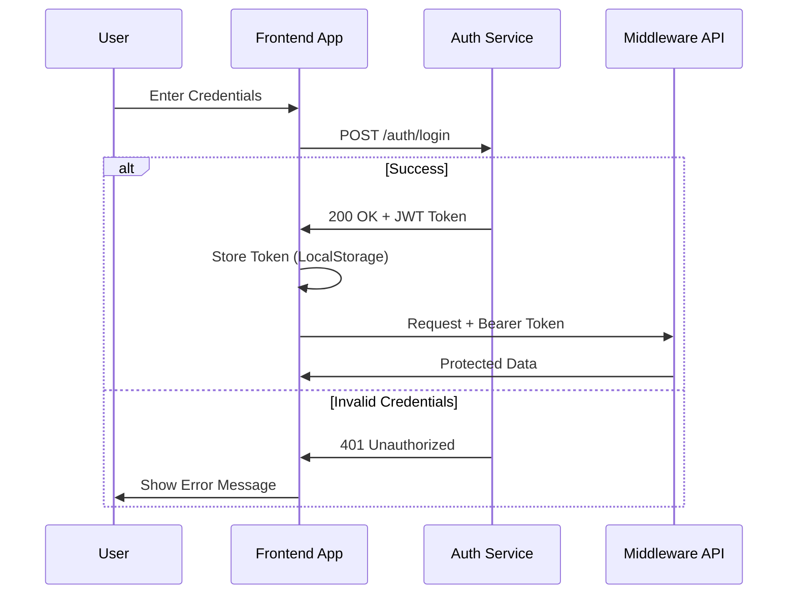

# API Specification (v13.0.1)

**Protocol:** REST (HTTPS) + WebSocket (WSS)  
**Base URL:** `http://localhost:3001/api/v1` (Middleware)  
**WS URL:** `ws://localhost:3000/ws` (Core Backend)

## 1. Authentication

The middleware uses JWT for secure endpoint access.

### Authentication Flow



### Login

`POST /auth/login`

**Request Body:**

```json
{
  "username": "admin",
  "password": "..."
}
```

**Response (Success):**
```json
{
  "success": true,
  "data": {
    "token": "eyJhbG..."
  },
  "message": "Authentication successful"
}
```

---

## 2. Real-Time Telemetry (WebSocket)

The Core Backend broadcasts the global state at 60Hz.

### Global State Model
The JSON payload broadcast to all clients:

```json
{
  "state": "Chill | Build | Chaos",
  "genre": "Ambient | Techno | DnB | Dubstep | Unknown",
  "bpm": 128.0,
  "glitch_factor": 0.0,
  "low_energy": 0.85,
  "mid_energy": 0.42,
  "high_energy": 0.15,
  "ai_theme": "NEON_VIBE",
  "ai_primary_color": "#FF00FF",
  "ai_secondary_color": "#00FFFF",
  "ai_directive": "MAXIMIZE_EUPHORIA",
  "system_stats": {
    "cpu_usage": 12.5,
    "memory_used": 2048576,
    "memory_total": 8589934592,
    "uptime": 3600
  },
  "audio_meta": {
    "device_name": "Stereo Mix",
    "sample_rate": 44100,
    "channels": 2
  }
}
```

---

## 3. REST API Endpoints

### Health Check
`GET /health` (Exposed at root)

Returns the system uptime and timestamp.

### Vibe Status (Authenticated)

`GET /vibe/status`

**Header:** `Authorization: Bearer <token>`

Returns a summary of the current vibe and live telemetry.

### System Metrics

`GET /metrics/metrics`

Returns platform-specific performance metrics (CPU load, memory distribution).

---

## 4. Error Handling

All REST errors follow this format:

```json
{
  "success": false,
  "error": "Error message description",
  "code": 401
}
```

---

## Revision History
| Date | Version | Description |
| :--- | :--- | :--- |
| 2026-01-09 | 13.0.1 | Reorganized structure; added Auth & Metrics documentation. |
| 2026-01-09 | 13.0.0 | Initial WebSocket specification. |
