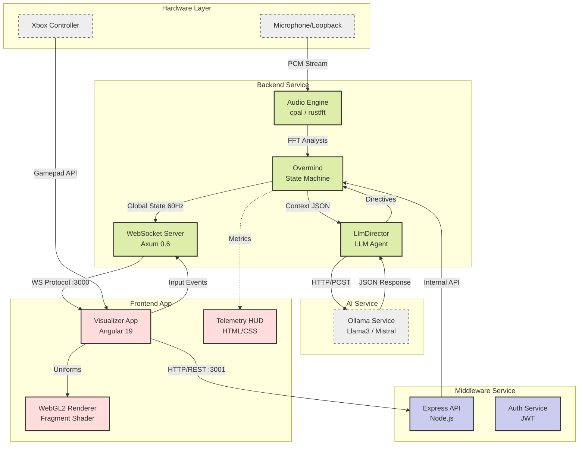
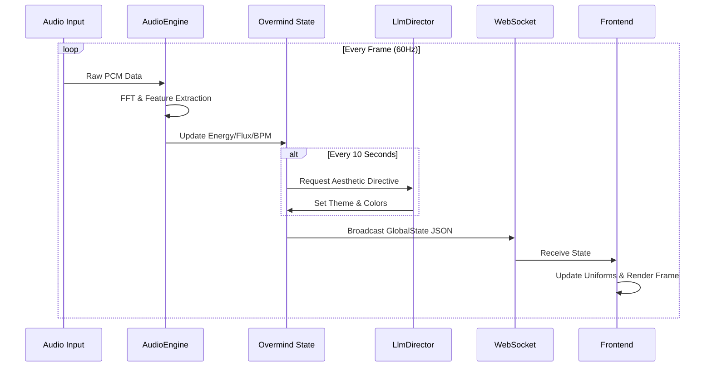

# System Architecture: VIBES v13

## Overview

The VIBES system adheres to the **"Overmind" Architecture**, a centralized state-driven model where a high-performance backend orchestrates audio analysis, AI logic, and global state broadcasting, while a decoupled frontend focuses on visual rendering.

## Component Diagram



## Data Flow Diagram (The Overmind Loop)



## Directory Structure

Following professional monorepo standards, the project is organized into `apps/` and `infra/`:

```text
v13/
├── apps/           # Primary Source Code (Services)
│   ├── backend/    # Core Rust Audio Engine
│   ├── frontend/   # Angular 19 WebGL Visualizer
│   └── middleware/ # Node.js Orchestration & Auth
├── infra/          # Infrastructure & Shared Tooling
│   ├── build/      # Compilation outputs
│   ├── config/     # Secrets and env files
│   └── scripts/    # Utility automation
├── docs/           # Technical and user documentation
├── tests/          # Consolidated test suites

```

## Core Modules

### 1. Core Backend (`apps/backend`)

- **AudioEngine**: Utilizes `cpal` for low-latency system audio capture.
- **Overmind**: The primary state machine. Performs heuristic analysis to detect genres and vibe states.
- **LlmDirector**: Integrates with Ollama to provide high-level aesthetic directives.

### 2. Middleware (`apps/middleware`)

- Provides a secure REST API layer.
- Handles JWT authentication for system control.
- Collects and aggregates system health metrics.

### 3. Frontend (`apps/frontend`)

- **Renderer**: Single-pass fragment shader for 4K raymarching.
- **HUD**: Glassmorphism UI for real-time telemetry display.
- **InputManager**: Maps hardware controller events to visual parameters.

## Design Decisions

- **Unidirectional Data Flow**: State always flows from Backend to Frontend to minimize latency and synchronization issues.
- **Stric Type Safety**: Rust in the backend and TypeScript (Strict Mode) in the frontend ensure deterministic behavior.
- **Hardware Acceleration**: Heavy lifting is offloaded to the GPU via WebGL2/GLSL.
